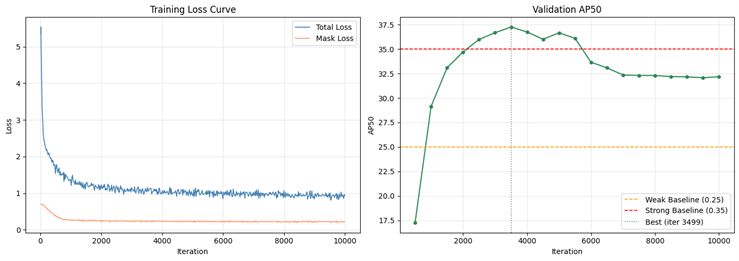
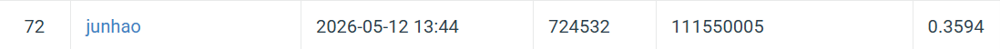

# HW3 — Cell Instance Segmentation

NYCU Computer Vision 2026 — HW3  
Student: 111550005 林均豪

## Introduction

This project implements instance segmentation on a medical H&E cell imaging dataset with four cell types (class1–class4). The solution is based on **Mask R-CNN** with a **ResNet-50 + FPN** backbone, implemented using the [Detectron2](https://github.com/facebookresearch/detectron2) framework.

**Public leaderboard score: 0.3594 (AP50)**

---

## Environment Setup

### Requirements

- Python 3.10+
- PyTorch 2.x with CUDA
- Detectron2
- tifffile, opencv-python, pycocotools, imagecodecs

### Installation

```bash
# Install PyTorch (adjust CUDA version as needed)
pip install torch torchvision

# Install Detectron2
pip install 'git+https://github.com/facebookresearch/detectron2.git'

# Install other dependencies
pip install tifffile opencv-python-headless pycocotools imagecodecs
pip install tensorboard==2.14.0
```

---

## Dataset Structure

Place the dataset under `hw3_data/` with the following structure:

```
hw3_data/
  train/
    <image_folder>/
      image.tif
      class1.tif
      class2.tif
      class3.tif
      class4.tif
  test_release/
    <image_name>.tif
  test_image_name_to_ids.json
```

---

## Usage

### Training

```bash
python train.py \
  --data-root hw3_data \
  --output-dir output_r50_v2 \
  --max-iter 10000 \
  --batch-size 2 \
  --lr 5e-5
```

To resume from the last checkpoint:

```bash
python train.py --resume
```

Key arguments:

| Argument | Default | Description |
|----------|---------|-------------|
| `--data-root` | `hw3_data` | Path to dataset root |
| `--output-dir` | `output_r50_v2` | Where to save checkpoints |
| `--max-iter` | `10000` | Total training iterations |
| `--batch-size` | `2` | Images per iteration |
| `--lr` | `5e-5` | Base learning rate |
| `--resume` | `False` | Resume from last checkpoint |

### Inference

```bash
python inference.py \
  --checkpoint output_r50_v2/model_0003499.pth \
  --data-root hw3_data \
  --output submission.zip
```

Key arguments:

| Argument | Default | Description |
|----------|---------|-------------|
| `--checkpoint` | required | Path to model checkpoint |
| `--data-root` | `hw3_data` | Path to dataset root |
| `--output` | `submission.zip` | Output zip file |

---

## Performance

| Split | AP50 |
|-------|------|
| Validation (iter 3499) | 37.27 |
| Public Test (CodaBench) | **35.94** |

### Per-category AP50 (Validation)

| Class | AP50 |
|-------|------|
| class1 | 37.47 |
| class2 | 35.61 |
| class3 | 16.59 |
| class4 | 41.33 |

---

## Method Summary

- **Model**: Mask R-CNN with ResNet-50 + FPN backbone
- **Pretrained weights**: COCO (3x schedule)
- **Optimizer**: SGD (momentum=0.9, weight_decay=1e-4)
- **Learning rate**: 5×10⁻⁵ with step decay at iter 8000 and 9000
- **Augmentation**: H/V flip, rotation ±15°, brightness/contrast jitter, multi-scale resize
- **Checkpoint selection**: Best val AP50 at iter 3499 used for final inference

---
### Training Curves



### Leaderboard


